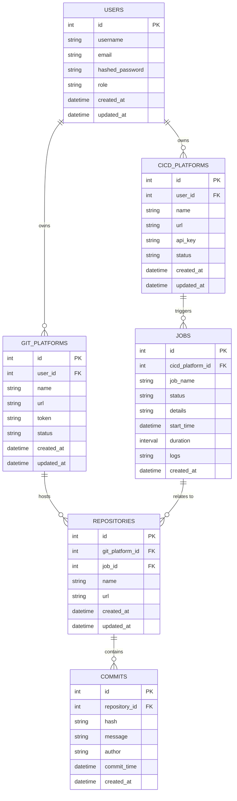

# ci-cd-analyzer
 This repo contain backend and frontend for browser extension that analyze your ci/cd pipelines based on your repos

---
# PostgresSQL Structure

``` mermaid
erDiagram
    USERS {
      int id PK
      string username
      string email
      string hashed_password
      string role
      datetime created_at
      datetime updated_at
    }
    
    CICD_PLATFORMS {
      int id PK
      int user_id FK
      string name
      string url
      string api_key
      string status
      datetime created_at
      datetime updated_at
    }
    
    GIT_PLATFORMS {
      int id PK
      int user_id FK
      string name
      string url
      string token
      string status
      datetime created_at
      datetime updated_at
    }
    
    JOBS {
      int id PK
      int cicd_platform_id FK
      string job_name
      string status
      string details
      datetime start_time
      interval duration
      string logs
      datetime created_at
    }
    
    REPOSITORIES {
      int id PK
      int git_platform_id FK
      int job_id FK
      string name
      string url
      datetime created_at
      datetime updated_at
    }
    
    COMMITS {
      int id PK
      int repository_id FK
      string hash
      string message
      string author
      datetime commit_time
      datetime created_at
    }
    
    USERS ||--o{ CICD_PLATFORMS : "owns"
    USERS ||--o{ GIT_PLATFORMS : "owns"
    CICD_PLATFORMS ||--o{ JOBS : "triggers"
    GIT_PLATFORMS ||--o{ REPOSITORIES : "hosts"
    JOBS ||--o{ REPOSITORIES : "relates to"
    REPOSITORIES ||--o{ COMMITS : "contains"
```
